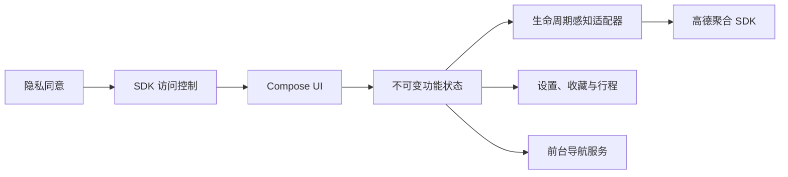

# SimpleMap

<div align="center">
	<p><strong>一款面向真实出行流程的 Android 地图与导航应用</strong></p>
	<p>地点搜索 · 多方式路线规划 · 竖横屏实时导航 · 行程复盘</p>
	<p>
		<a href="https://github.com/qaz6750/SimpleMap/actions/workflows/android-verify.yml"></a>
		
		
		
	</p>
	<p><strong>中文</strong> · <a href="README_EN.md">English</a></p>
</div>

SimpleMap 使用 Kotlin、Jetpack Compose、Material 3 与高德 Android 导航 SDK 构建，覆盖从找到目的地、比较路线到实时导航和行程复盘的完整链路。界面采用清晰的蓝白视觉体系，并把下一步驾驶动作、距离、道路和车道信息放在首要位置。

> [!IMPORTANT]
> 运行项目需要自行申请高德 Android Key。当前原生导航依赖仅打包 `arm64-v8a`，真实地图与导航回归需要 ARM64 真机或兼容设备云。

## 为什么是 SimpleMap

| 驾驶信息优先 | 地图交互完整 | 隐私边界明确 |
| :--- | :--- | :--- |
| 竖屏与横屏分别优化，减少重复数字和低优先级信息，让驾驶员快速识别下一步动作。 | 模糊地点搜索、多方式路线、2D / 3D / 正北、路况、卫星图和动态比例尺形成完整操作闭环。 | 用户明确同意前不初始化高德 SDK；收藏、设置和行程摘要只保存在本机，不记录导航轨迹点。 |

## 体验亮点

### 地图与搜索

- 多查询变体合并召回，并按名称精确度、包含关系、字符顺序和距离进行模糊排序。
- 主搜索聚焦地点与地址，过滤公交站 POI；公交出行仍可在路线规划中使用。
- 支持实时路况、卫星图、定位、组合缩放控件和随镜头变化的 Compose 比例尺。
- 可在 2D、3D 视角间切换，并一键恢复地图正北；图层选择后自动收起操作面板。
- 支持家、公司和自定义收藏分组，可从搜索结果或收藏直接发起路线规划。

### 路线规划

- 对比驾车、公交、骑行和步行方案，候选路线与选中状态同步显示在地图上。
- 上滑即可展开路线详情，以摘要指标和时间轴步骤呈现完整分段信息。
- 驾车支持途经点排序，以及通勤、高速优先、新能源省电等偏好预设。
- 避堵、避免高速、少收费等手动偏好保存在本机，可在后续规划中复用。
- 启动导航时匹配用户选中的高德路径；满足 SDK 条件时，可在导航设置中切换备选路线。

### 实时导航

- 竖屏手机与横屏车机采用独立布局，支持官方路口放大图、真实车道、车速、限速和沿途设施。
- 导航默认使用 3D 锁车视角，也可切换为 2D；前后台导航会话共享同一持久化设置。
- 移动地图后显示“继续导航”，连续交互会重置倒计时，停止操作 10 秒后自动恢复跟随。
- 路线按实时路况着色；拥堵变化、预计到达时间变化和路线事件经过合并与去重，避免重复提示。
- GPS 状态以紧凑图标呈现，并区分系统定位关闭、弱信号、低精度漂移和连续未匹配路线。
- 日间与夜间模式会同时切换导航控件和高德导航底图；进入隧道时可临时启用夜间显示。
- 前台 Service 持有真实导航会话，离开 Activity 后仍可继续定位和播报，并可从通知返回或结束导航。
- 语音支持详细、简洁和静音三级，并提供跨午夜静音时段与独立的重要提示开关。

### 行程与本地能力

- “我的”采用纵向入口列表，收藏地点在分组内以紧凑行展示，适合快速扫描和重复操作。
- 行程历史记录到达、取消和失败状态，以及真实耗时、里程和平均速度；模拟导航会被明确标记。
- 到达后可搜索终点 3 公里内停车场，保存本地停车点并规划步行返回路线。
- 支持高德离线城市包、容量统计和仅 Wi-Fi 下载策略。
- 设置页显示当前版本，并可按需检查 `qaz6750/SimpleMap` 的最新 GitHub Release。
- 提供本地数据清除与隐私同意撤回入口。

## 隐私优先

SimpleMap 将隐私同意作为地图能力的硬边界，而不是一个普通弹窗：

1. 启动时先读取本地隐私状态。
2. 未持久化明确同意时，不创建或调用任何高德地图、定位、搜索和导航 API。
3. 同意后才进入地图主页并初始化 SDK 适配器。
4. 用户可随时清除本地数据或撤回同意；下次启动会重新进入隐私确认流程。

此外，Android 云备份和设备迁移已关闭。行程历史只保存摘要，不保存轨迹点；GPS 诊断也不会写入坐标或位置历史。

## 快速开始

### 环境要求

- JDK 17
- Android SDK Platform 36 与 Build Tools 36.0.0
- 已绑定 `com.simplemap` 包名和签名信息的高德 Android Key
- 验证真实导航时需要一台已授权调试的 ARM64 Android 设备

### 1. 获取项目

```bash
git clone https://github.com/qaz6750/SimpleMap.git
cd SimpleMap
```

### 2. 配置本地环境

```bash
cp local.properties.example local.properties
```

编辑 `local.properties`：

```properties
sdk.dir=/absolute/path/to/Android/Sdk
AMAP_API_KEY=your_android_key
```

`local.properties` 已被 Git 忽略。请勿提交真实 Key、签名文件、位置记录或用户数据。

### 3. 构建并安装

```bash
./gradlew assembleDebug
adb install -r app/build/outputs/apk/debug/app-debug.apk
```

Windows 可使用 `gradlew.bat assembleDebug`。首次启动后，需要先在应用内确认隐私说明，地图和定位能力才会初始化。

## 构建与验证

执行 JVM 单元测试、Android Lint、Debug APK 与 Android 测试 APK 构建：

```bash
./gradlew testDebugUnitTest lintDebug assembleDebug assembleDebugAndroidTest
```

构建 Release APK 与 AAB：

```bash
./gradlew assembleRelease bundleRelease
```

| 产物 | 路径 |
| :--- | :--- |
| Debug APK | `app/build/outputs/apk/debug/app-debug.apk` |
| 未签名 Release APK | `app/build/outputs/apk/release/app-release-unsigned.apk` |
| Release AAB | `app/build/outputs/bundle/release/app-release.aab` |
| Android 测试 APK | `app/build/outputs/apk/androidTest/debug/app-debug-androidTest.apk` |
| Lint 报告 | `app/build/reports/lint-results-debug.html` |

连接且仅连接一台已授权 ARM64 设备后，可运行设备回归：

```bash
ADB="$ANDROID_HOME/platform-tools/adb" ./scripts/device-regression.sh all
```

脚本会安装应用与测试 APK、执行仪器测试，并清除应用数据后启动在线回归。详细检查项见 [设备回归清单](docs/device-regression.md)。

兼容范围覆盖 Android 8.0（API 26）到 Android 16（API 36）；Android 17（API 37）当前仅作为 Beta 前瞻验证目标。各版本行为变更与真机重点同样记录在设备回归清单中。

## 技术栈

| 领域 | 版本或实现 |
| :--- | :--- |
| 语言 | Kotlin 2.1.10 |
| UI | Jetpack Compose + Material 3，Compose BOM 2025.03.01 |
| Android | minSdk 26，compileSdk / targetSdk 36 |
| 构建 | Gradle Kotlin DSL，Gradle 8.13，Android Gradle Plugin 8.13.2，JDK 17 |
| 地图与导航 | 高德 `navi-3dmap-location-search` 11.2 聚合依赖 |
| 架构 | 单 Activity、不可变 UI 状态、单向数据流、生命周期感知 View 适配器 |
| 本地存储 | SharedPreferences，仅保存设置、收藏和行程摘要 |

## 架构设计



应用采用单 Activity Compose 架构。高德 `MapView` 与 `AMapNaviView` 位于生命周期感知的 Android View 适配层之后，Compose 只消费功能级状态并发送用户意图。设备旋转时复用同一个导航 View，并原地更新车辆中心和安全区域，避免无意义的重复算路。

真实导航会话由 `NavigationSessionCoordinator` 与前台 Service 共同持有，使导航引擎生命周期与页面重建解耦。SDK 回调切换到主线程后再更新 UI 状态，转向位图缓存限制为 32 项。

<details>
	<summary><strong>查看项目结构</strong></summary>

```text
SimpleMap/
├── app/src/main/java/com/simplemap/
│   ├── amap/        # MapView 适配、覆盖物与相机控制
│   ├── navigation/  # 导航会话、SDK 回调、前台服务与状态
│   ├── offline/     # 离线城市包
│   ├── privacy/     # 隐私同意与本地数据控制
│   ├── route/       # 路线请求、方案与高德路线仓库
│   ├── search/      # POI、模糊排序与停车场搜索
│   ├── settings/    # 导航设置和本地持久化
│   ├── startup/     # 启动与 SDK 访问边界
│   ├── trips/       # 行程历史与停车位置
│   ├── update/      # GitHub Release 更新检查
│   └── ui/          # Compose 页面、面板和主题
├── app/src/test/           # JVM 单元测试
├── app/src/androidTest/    # Compose 仪器测试
├── docs/                   # 设备回归与兼容性文档
└── scripts/                # 真机回归脚本
```

</details>

## 持续集成与发布

| 工作流 | 触发方式 | 职责 |
| :--- | :--- | :--- |
| [Android Verify](.github/workflows/android-verify.yml) | Push / Pull Request | 检查高德依赖白名单，运行单测与 Lint，构建 Debug 和 Android 测试 APK。 |
| [Android Manual Build](.github/workflows/android-manual-build.yml) | 手动触发 | 选择 Debug、Release 或全部产物；构建前强制检查 `AMAP_API_KEY` Secret。 |
| [Android Release](.github/workflows/android-release.yml) | 推送匹配版本的 `v*` 标签 | 验证并构建 Release APK / AAB，生成 SHA-256 校验文件并创建 GitHub Release。 |

自动验证流程不读取高德 Key。手动构建和发布流程只将 `AMAP_API_KEY` Secret 写入运行器的临时 `local.properties`，不会上传或提交该文件。应用内更新检查以最新正式 GitHub Release 为数据源。

## SDK 边界与已知限制

- 项目只使用 `com.amap.api:navi-3dmap-location-search` 聚合依赖。请勿重复添加 `navi-3dmap`、`3dmap`、`location` 或 `search`，否则可能产生重复类和原生库冲突。
- 当前仅打包 `arm64-v8a`，标准 x86_64 模拟器无法运行高德原生导航引擎。
- 地图、搜索、算路和导航回归需要有效 Key、网络环境与 ARM64 真机或兼容设备云。
- 多路线导航仅用于实时驾车、多路径策略、无途经点且起终点直线距离不超过 80 公里的场景。
- 高德公开 SDK 当前没有交通事件上报端点；`onUpdateDriveEvent` 与 `onNaviRouteNotify` 是下行通知，不会被项目误用为上传接口。
- Release 构建经过 R8 压缩和资源裁剪，但默认产物未签名，正式分发前需配置独立签名。
- 后台持续导航可能受到厂商省电和后台限制影响，请按 [设备回归清单](docs/device-regression.md) 在目标设备上验证。
