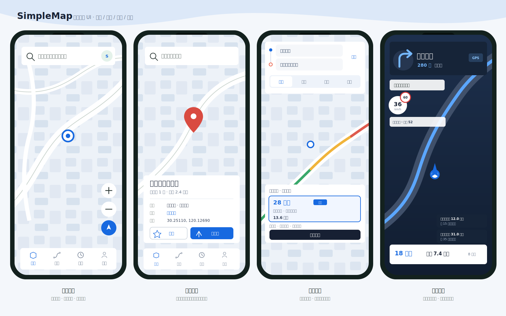
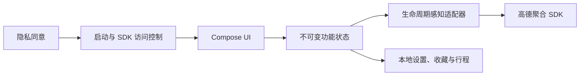

# SimpleMap

中文 | [English](README_EN.md)

基于 Kotlin、Jetpack Compose、Material 3 与高德 Android 导航 SDK 构建的原生地图导航应用。



SimpleMap 覆盖从地点搜索、路线规划到实时导航和行程复盘的完整流程。应用以隐私同意为启动边界：只有在用户明确同意且状态持久化后，才会初始化或调用高德地图、定位、搜索与导航能力。

> [!IMPORTANT]
> 运行项目需要自行申请高德 Android Key。当前原生导航依赖只打包 `arm64-v8a`，真实地图与导航回归应在 ARM64 真机或兼容设备云上完成。

## 核心能力

### 地图与搜索

- 全屏地图主页，支持实时路况、卫星图、定位、缩放和手势控制。
- 搜索 POI 与公交线路，按距离展示附近地点，并提供地点详情和地图标记。
- 本地保存家、公司及自定义收藏夹；可从搜索结果或收藏直接发起路线规划。
- 定位权限按需申请，拒绝后仍可浏览不依赖当前位置的功能，并可跳转系统权限设置。

### 路线规划

- 对比驾车、公交、骑行和步行方案，地图同步展示候选路线。
- 驾车支持途经点排序，以及通勤、高速优先、新能源省电等偏好预设。
- 避堵、避免高速、少收费等手动偏好保存在本机，可在后续规划中复用。
- 启动导航时会将用户选中的规划方案匹配到高德导航路径；满足 SDK 约束时，可在导航设置中查看并切换备选路线。

### 实时导航

- GPS 导航、内置语音、实时路况、路线总览，以及偏航和拥堵重算。
- 前台 Service 持有真实导航会话；离开 Activity 后仍可继续定位与播报，并可从通知返回或结束导航。
- 竖屏手机与横屏车机自适应布局，支持官方路口放大图、真实车道信息、车速、限速、区间测速和沿途设施。
- 路线按实时路况着色，拥堵变化、预计到达时间变化和路线事件使用去重提示，避免重复播报。
- GPS 诊断区分系统定位未开启、弱信号、低精度漂移和连续未匹配路线；应用不保存导航轨迹点。
- 地图主题支持跟随系统、按时间、始终日间和始终夜间，进入隧道时可临时切换夜间底图。
- 语音支持详细、简洁和静音三级，并提供跨午夜静音时段与独立的重要提示开关。

### 行程与本地能力

- 到达后搜索终点 3 公里内停车场，保存一个本地停车点并规划步行返回路线。
- 行程历史记录到达、取消和失败状态，以及真实耗时、里程和平均速度；模拟导航会被明确标记。
- 行程摘要仅保存在本机且不含轨迹点，可一键复用路线与导航偏好。
- 支持高德离线城市包、容量统计和仅 Wi-Fi 下载策略。
- 提供本地数据清除与隐私同意撤回入口。

## 界面预览

| 场景 | 预览 |
| --- | --- |
| 产品总览 | [四屏总览](docs/simplemap-ui-preview.svg) |
| 搜索与收藏 | [上下文搜索](docs/contextual-search-preview.svg) · [常用地点](docs/favorite-places-preview.svg) |
| 路线规划 | [路线增强](docs/route-enhancements-preview.svg) |
| 导航布局 | [竖屏导航](docs/navigation-portrait-preview.svg) · [横屏车机](docs/navigation-junction-landscape-preview.svg) |
| 导航适配 | [弱 GPS 与夜间模式](docs/navigation-gps-night-preview.svg) · [紧凑屏与大字体](docs/navigation-compact-layout-preview.svg) |
| 设置与数据 | [主题与语音](docs/theme-voice-settings-preview.svg) · [持续导航与行程复盘](docs/persistent-navigation-trips-preview.svg) |
| 离线与隐私 | [离线下载策略](docs/offline-download-policy-preview.svg) · [隐私与数据控制](docs/privacy-data-controls-preview.svg) |

预览图中的地图和转向符号用于展示布局。真实导航时，转向图标来自高德 `NaviInfo.iconBitmap`，路线、路况和导航事件来自 SDK 回调。

## 技术栈

| 项目 | 版本或实现 |
| --- | --- |
| 语言 | Kotlin 2.1.10 |
| UI | Jetpack Compose + Material 3，Compose BOM 2025.03.01 |
| Android | minSdk 26，compileSdk / targetSdk 35 |
| 构建 | Gradle Kotlin DSL，Android Gradle Plugin 8.8.2，JDK 17 |
| 地图与导航 | 高德 `navi-3dmap-location-search` 11.2 聚合依赖 |
| 架构 | 单 Activity、不可变 UI 状态、单向数据流、生命周期感知 View 适配器 |

## 快速开始

### 环境要求

- JDK 17。
- Android SDK Platform 35 与对应 Build Tools。
- 一个已绑定应用包名和签名信息的高德 Android Key。
- 如需验证真实导航：一台已授权调试的 ARM64 Android 设备。

### 配置

1. 复制本地配置模板：

	```bash
	cp local.properties.example local.properties
	```

2. 编辑 `local.properties`：

	```properties
	sdk.dir=/absolute/path/to/Android/Sdk
	AMAP_API_KEY=your_android_key
	```

	`local.properties` 已被 Git 忽略。不要把真实 Key、签名文件、位置记录或用户数据提交到版本库。

3. 构建 Debug APK：

	```bash
	./gradlew assembleDebug
	```

	Windows 可运行 `gradlew.bat assembleDebug`。

4. 安装到设备：

	```bash
	adb install -r app/build/outputs/apk/debug/app-debug.apk
	```

首次启动后，需要先在应用内确认隐私协议，地图和定位功能才会初始化。

## 构建与验证

运行仓库要求的完整本地检查：

```bash
./gradlew testDebugUnitTest lintDebug assembleDebug
```

构建 Release APK 和 Android 测试 APK：

```bash
./gradlew assembleRelease assembleDebugAndroidTest
```

| 产物 | 路径 |
| --- | --- |
| Debug APK | `app/build/outputs/apk/debug/app-debug.apk` |
| 未签名 Release APK | `app/build/outputs/apk/release/app-release-unsigned.apk` |
| Android 测试 APK | `app/build/outputs/apk/androidTest/debug/app-debug-androidTest.apk` |
| Lint 报告 | `app/build/reports/lint-results-debug.html` |

连接且仅连接一台已授权的 ARM64 设备后，可运行设备回归：

```bash
ADB="$ANDROID_HOME/platform-tools/adb" ./scripts/device-regression.sh all
```

脚本会安装应用与测试 APK、执行仪器测试，并清除应用数据后启动在线回归。详细检查项见 [设备回归清单](docs/device-regression.md)。

## 项目结构

```text
SimpleMap/
├── app/src/main/java/com/simplemap/
│   ├── amap/        # MapView 适配、地图覆盖物与相机控制
│   ├── navigation/  # 导航会话、SDK 回调、前台服务与导航状态
│   ├── offline/     # 离线城市包
│   ├── privacy/     # 隐私同意与本地数据控制
│   ├── route/       # 路线请求、方案与高德路线仓库
│   ├── search/      # POI、公交与停车场搜索
│   ├── settings/    # 导航设置和本地持久化
│   ├── startup/     # 启动与 SDK 访问边界
│   ├── trips/       # 行程历史与停车位置
│   └── ui/          # Compose 页面、面板和主题
├── app/src/test/           # JVM 单元测试
├── app/src/androidTest/    # Compose 仪器测试
├── docs/                   # UI 预览与设备回归文档
└── scripts/                # 真机回归脚本
```

## 架构



应用采用单 Activity Compose 架构。高德 `MapView` 与 `AMapNaviView` 保持在生命周期感知的 Android View 适配层中；Compose 只消费功能级状态并发送用户意图。设备旋转时复用同一个导航 View，并原地更新车辆中心与布局，避免无意义的重复算路。

真实导航会话由 `NavigationSessionCoordinator` 和前台 Service 共同持有，使页面重建与导航引擎生命周期解耦。所有 SDK 回调切换到主线程后再更新 UI 状态，转向位图缓存限制为 32 项。

## 隐私与安全

- 未持久化明确隐私同意前，不调用任何高德 SDK API。
- 高德 Key 由 `local.properties` 注入 Manifest 和 `BuildConfig`，不进入源码或版本库。
- Android 云备份和设备迁移已关闭，避免收藏、行程、设置与隐私状态离开设备。
- 行程历史只保存摘要，不保存轨迹点；GPS 诊断也不会写入坐标或位置历史。
- 用户可以清除本地数据、撤回隐私同意，并在系统设置中管理定位权限。

## 高德 SDK 边界

- 项目只使用 `com.amap.api:navi-3dmap-location-search` 聚合依赖。不要再添加 `navi-3dmap`、`3dmap`、`location` 或 `search`，否则可能产生重复类和原生库冲突。
- 多路线导航仅用于实时驾车、多路径策略、无途经点且起终点直线距离不超过 80 公里的场景。
- 高德公开 SDK 当前没有交通事件上报端点；`onUpdateDriveEvent` 与 `onNaviRouteNotify` 是下行通知，本项目不会将其误用为上传接口。
- `com.amap.lbs.client:amap-agent:1.1.41` 目前无法从 Google Maven 或 Maven Central 解析，因此未加入构建。启用相关能力需要高德提供兼容 AAR 或私有仓库凭据。

## 已知限制

- 当前仅打包 `arm64-v8a`，标准 x86_64 模拟器无法运行高德原生导航引擎。
- 仪器测试需要 ARM64 真机或兼容设备云；地图、搜索、算路和导航回归还需要有效 Key 与网络环境。
- Release 构建经过 R8 压缩和资源裁剪，但默认产物未签名，正式发布前需配置独立签名。
- 后台持续导航仍可能受到不同厂商系统的省电和后台限制影响，应按 [设备回归清单](docs/device-regression.md) 在目标设备上验证。

## 持续集成

[Android CI](.github/workflows/android-ci.yml) 在 Push 和 Pull Request 中执行：

- 高德依赖白名单检查。
- JVM 单元测试与 Android Lint。
- Debug、Release 和 Android 测试 APK 构建。
- APK、Lint 报告与关键 UI 预览上传。

由于标准 GitHub x86_64 模拟器无法加载高德原生导航引擎，CI 只编译 Android 测试 APK；交互和在线能力由 ARM64 设备回归覆盖。
