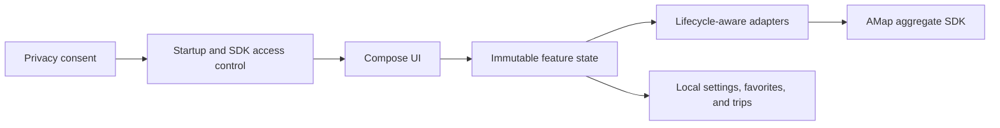

# SimpleMap

[中文](README.md) | English

A native Android map and navigation app built with Kotlin, Jetpack Compose, Material 3, and the AMap Android Navigation SDK.


SimpleMap covers the complete journey from place search and route planning to live navigation and trip review. Persisted privacy consent is a hard startup boundary: the app does not initialize or call any AMap map, location, search, or navigation API until the user has explicitly agreed.

> [!IMPORTANT]
> You need your own AMap Android key to run the project. The native navigation dependency is currently packaged for `arm64-v8a` only, so live map and navigation regression testing requires an ARM64 physical device or a compatible device cloud.

## Core Capabilities

### Map and Search

- Full-screen map home with live traffic, satellite imagery, location, zoom, and gesture controls.
- POI and transit-line search, nearby results ordered by distance, place details, and map markers.
- On-device Home, Work, and custom favorite collections. Start route planning directly from a search result or favorite.
- Location permission is requested only when needed. Users who decline can still use features that do not require their current location and can open system permission settings later.

### Route Planning

- Compare driving, transit, cycling, and walking routes while candidate paths remain visible on the map.
- Reorder driving waypoints and choose presets such as Commute, Highway First, and EV Energy Saving.
- Manual preferences such as avoiding congestion, avoiding highways, and minimizing tolls persist on-device for reuse.
- When navigation starts, the selected plan is matched to an AMap navigation path. When SDK constraints are satisfied, alternative routes can be viewed and selected from navigation settings.

### Live Navigation

- GPS navigation, built-in voice guidance, live traffic, route overview, and rerouting after deviation or congestion.
- A foreground service owns the live navigation session. Location and voice guidance can continue after leaving the Activity, with notification actions to return or end navigation.
- Adaptive portrait phone and landscape vehicle layouts with official junction views, real lane guidance, speed, speed limits, interval-speed cameras, and roadside facilities.
- Route segments are colored by live traffic. Congestion changes, ETA changes, and route events use de-duplicated alerts to avoid repeated announcements.
- GPS diagnostics distinguish disabled system location, weak signal, low-accuracy drift, and prolonged route mismatch. Navigation trace points are not stored.
- Map themes support Follow System, Time Based, Always Day, and Always Night, with temporary night-map activation in tunnels.
- Voice guidance supports Detailed, Concise, and Mute levels, plus a cross-midnight quiet period and an independent important-alert toggle.

### Trips and On-Device Features

- Search for parking within 3 km after arrival, save one local parking location, and plan a walking route back.
- Trip history records arrived, cancelled, and failed outcomes with actual duration, distance, and average speed. Simulated navigation is clearly labeled.
- Trip summaries remain on-device and contain no trace points. Routes and navigation preferences can be reused with one tap.
- AMap offline city packages include capacity information and a Wi-Fi-only download policy.
- Users can clear local data and revoke privacy consent from the app.

## UI Previews

| Scenario | Preview |
| --- | --- |
| Product overview | [Four-screen overview](docs/simplemap-ui-preview.svg) |
| Search and favorites | [Contextual search](docs/contextual-search-preview.svg) · [Favorite places](docs/favorite-places-preview.svg) |
| Route planning | [Route enhancements](docs/route-enhancements-preview.svg) |
| Navigation layouts | [Portrait navigation](docs/navigation-portrait-preview.svg) · [Landscape vehicle](docs/navigation-junction-landscape-preview.svg) |
| Navigation adaptation | [Weak GPS and night mode](docs/navigation-gps-night-preview.svg) · [Compact screen and large text](docs/navigation-compact-layout-preview.svg) |
| Settings and trip data | [Theme and voice](docs/theme-voice-settings-preview.svg) · [Persistent navigation and trip review](docs/persistent-navigation-trips-preview.svg) |
| Offline and privacy | [Offline download policy](docs/offline-download-policy-preview.svg) · [Privacy and data controls](docs/privacy-data-controls-preview.svg) |

The preview maps and maneuver symbols demonstrate layout only. During live navigation, maneuver icons come from AMap `NaviInfo.iconBitmap`, while route, traffic, and navigation events come from SDK callbacks.

## Technology

| Area | Version or implementation |
| --- | --- |
| Language | Kotlin 2.1.10 |
| UI | Jetpack Compose + Material 3, Compose BOM 2025.03.01 |
| Android | minSdk 26, compileSdk / targetSdk 36 |
| Build | Gradle Kotlin DSL, Gradle 8.13, Android Gradle Plugin 8.13.2, JDK 17 |
| Map and navigation | AMap `navi-3dmap-location-search` 11.2 aggregate dependency |
| Architecture | Single Activity, immutable UI state, unidirectional data flow, lifecycle-aware View adapters |

## Quick Start

### Requirements

- JDK 17.
- Android SDK Platform 36 and Build Tools 36.0.0.
- An AMap Android key bound to the application package and signing identity.
- For live navigation testing: an authorized ARM64 Android device.

### Configuration

1. Copy the local configuration template:

   ```bash
   cp local.properties.example local.properties
   ```

2. Edit `local.properties`:

   ```properties
   sdk.dir=/absolute/path/to/Android/Sdk
   AMAP_API_KEY=your_android_key
   ```

   `local.properties` is ignored by Git. Never commit a real key, signing file, location record, or user data.

3. Build the debug APK:

   ```bash
   ./gradlew assembleDebug
   ```

   On Windows, run `gradlew.bat assembleDebug`.

4. Install it on a device:

   ```bash
   adb install -r app/build/outputs/apk/debug/app-debug.apk
   ```

On first launch, accept the in-app privacy agreement before map and location capabilities are initialized.

## Build and Verification

Run the complete local checks required by the repository:

```bash
./gradlew testDebugUnitTest lintDebug assembleDebug
```

Build the release and Android test APKs:

```bash
./gradlew assembleRelease assembleDebugAndroidTest
```

| Artifact | Path |
| --- | --- |
| Debug APK | `app/build/outputs/apk/debug/app-debug.apk` |
| Unsigned release APK | `app/build/outputs/apk/release/app-release-unsigned.apk` |
| Android test APK | `app/build/outputs/apk/androidTest/debug/app-debug-androidTest.apk` |
| Lint report | `app/build/reports/lint-results-debug.html` |

With exactly one authorized ARM64 device connected, run the device regression workflow:

```bash
ADB="$ANDROID_HOME/platform-tools/adb" ./scripts/device-regression.sh all
```

The script installs the app and test APKs, executes instrumented tests, clears app data, and launches an online regression session. See the [device regression checklist](docs/device-regression.md) for the manual checks.

The supported range is Android 8.0 (API 26) through Android 16 (API 36). Android 17 (API 37) is currently tracked as a Beta compatibility target rather than a production target; version-specific checks are documented in the same checklist.

## Project Structure

```text
SimpleMap/
├── app/src/main/java/com/simplemap/
│   ├── amap/        # MapView adapter, overlays, and camera controls
│   ├── navigation/  # Navigation session, SDK callbacks, foreground service, and state
│   ├── offline/     # Offline city packages
│   ├── privacy/     # Privacy consent and local data controls
│   ├── route/       # Route requests, plans, and AMap route repository
│   ├── search/      # POI, transit, and parking search
│   ├── settings/    # Navigation settings and local persistence
│   ├── startup/     # Startup and SDK access boundary
│   ├── trips/       # Trip history and parking location
│   └── ui/          # Compose screens, panels, and theme
├── app/src/test/           # JVM unit tests
├── app/src/androidTest/    # Compose instrumented tests
├── docs/                   # UI previews and device regression documentation
└── scripts/                # Physical-device regression scripts
```

## Architecture



The app uses a single-Activity Compose architecture. AMap `MapView` and `AMapNaviView` stay behind lifecycle-aware Android View adapters; Compose consumes feature-level state and emits user intents. Device rotation retains the same navigation View and updates the vehicle center and layout in place, avoiding redundant route calculations.

`NavigationSessionCoordinator` and the foreground service jointly own a live navigation session, decoupling the navigation engine lifecycle from screen recreation. SDK callbacks are dispatched to the main thread before UI state updates, and the maneuver bitmap cache is capped at 32 entries.

## Privacy and Security

- No AMap SDK API is called before explicit privacy consent has been persisted.
- The AMap key is injected into the Manifest and `BuildConfig` from `local.properties`; it does not belong in source control.
- Android cloud backup and device transfer are disabled so favorites, trips, settings, and privacy state remain on the device.
- Trip history stores summaries only, never trace points. GPS diagnostics do not write coordinates or location history either.
- Users can clear local data, revoke privacy consent, and manage location permission in system settings.

## AMap SDK Boundaries

- The project uses only the `com.amap.api:navi-3dmap-location-search` aggregate dependency. Do not add `navi-3dmap`, `3dmap`, `location`, or `search` separately; doing so can introduce duplicate classes and native-library conflicts.
- Multi-route navigation is limited to live driving with a multi-path strategy, no waypoints, and a straight-line origin-to-destination distance no greater than 80 km.
- The public AMap SDK currently provides no traffic-event reporting endpoint. `onUpdateDriveEvent` and `onNaviRouteNotify` are downstream notifications and are not used as upload APIs.
- `com.amap.lbs.client:amap-agent:1.1.41` cannot currently be resolved from Google Maven or Maven Central, so it is not part of the build. Enabling it requires a compatible AAR or private repository credentials from AMap.

## Known Limitations

- Only `arm64-v8a` is packaged. The AMap native navigation engine cannot run on a standard x86_64 emulator.
- Instrumented tests require an ARM64 physical device or compatible device cloud. Map, search, routing, and navigation regression tests also require a valid key and network access.
- Release builds are R8-minified and resource-shrunk but unsigned by default. Configure a separate signing identity before distribution.
- Persistent background navigation can still be affected by vendor-specific battery and background restrictions. Validate target devices with the [device regression checklist](docs/device-regression.md).

## Continuous Integration

[Android Verify](.github/workflows/android-verify.yml) runs on pushes and pull requests and performs:

- AMap dependency allowlist verification.
- JVM unit tests and Android Lint.
- Debug and Android test APK builds.
- Debug APK, Android test APK, and Lint report uploads from the main branch.

[Android Manual Build](.github/workflows/android-manual-build.yml) can be started from the Actions page for Debug, Release, or all outputs. It requires the repository `AMAP_API_KEY` secret and fails before Gradle starts when the key is absent. The key is written only to the runner's temporary `local.properties`.

Pushing a `v*` tag that matches `versionName` in `app/build.gradle.kts` starts [Android Release](.github/workflows/android-release.yml). It verifies the project, builds the Release APK/AAB, generates SHA-256 checksums, and creates the GitHub Release used by the in-app update checker.

Because a standard GitHub x86_64 emulator cannot load the AMap native navigation engine, CI compiles the Android test APK without running device interactions. ARM64 device regression covers interactive and online behavior.